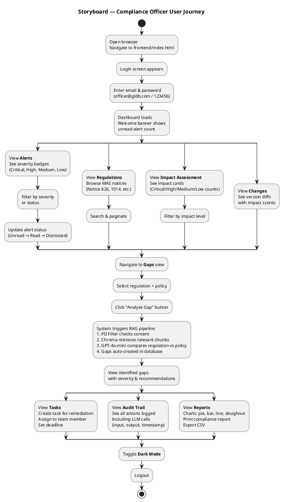

```plantuml
@startuml
skinparam shadowing false
skinparam defaultFontSize 11

title Storyboard — Compliance Officer User Journey

|Compliance Officer|

start

:Open browser\nNavigate to frontend/index.html;

:Login screen appears;
:Enter email & password\n(officer@gldb.com / 123456);

:Dashboard loads\nWelcome banner shows\nunread alert count;

split
  :View **Alerts**\nSee severity badges\n(Critical, High, Medium, Low);
  :Filter by severity\nor status;
  :Update alert status\n(Unread → Read → Dismissed);
split again
  :View **Regulations**\nBrowse MAS notices\n(Notice 626, 1014, etc.);
  :Search & paginate;
split again
  :View **Impact Assessment**\nSee impact cards\n(Critical/High/Medium/Low counts);
  :Filter by impact level;
split again
  :View **Changes**\nSee version diffs\nwith impact scores;
end split

:Navigate to **Gaps** view;
:Select regulation + policy;
:Click "Analyze Gap" button;

:System triggers RAG pipeline:\n1. PII Filter checks content\n2. Chroma retrieves relevant chunks\n3. GPT-4o-mini compares regulation vs policy\n4. Gaps auto-created in database;

:View identified gaps\nwith severity & recommendations;

split
  :View **Tasks**\nCreate task for remediation\nAssign to team member\nSet deadline;
split again
  :View **Audit Trail**\nSee all actions logged\nIncluding LLM calls\n(input, output, timestamp);
split again
  :View **Reports**\nCharts: pie, bar, line, doughnut\nPrint compliance report\nExport CSV;
end split

:Toggle **Dark Mode**;
:Logout;

stop

@enduml
```
